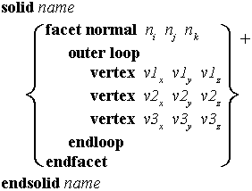
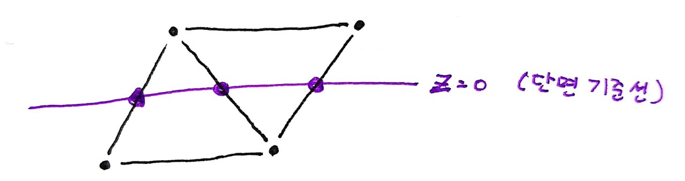
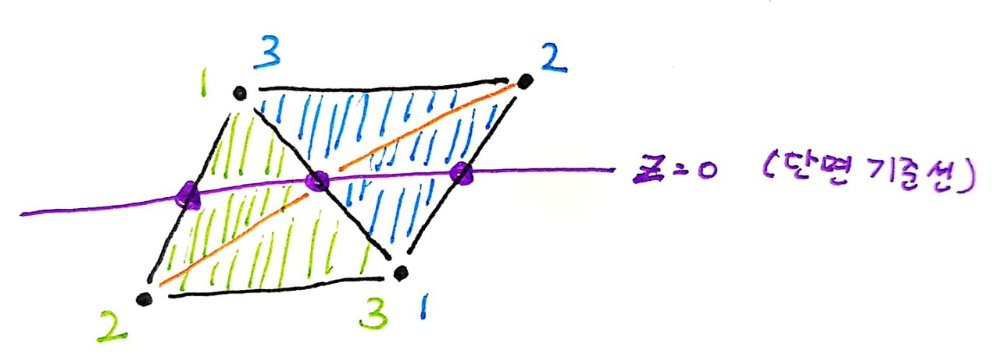

## 내용

STL 포멧으로 저장된 3D 오브젝트로 부터 입단면도를 생성하기 위한 중간단계로,

오브젝트를지정한 축을 기준으로 깊이에 따라 3개의 영역으로 나눔

## 주요 개념

### 1\. Facet 

STL 파일은 여러개의 삼각형(Facet)이 모여 3D 물체의 표면을 이룬다.

각 삼각형의 점들은 'vertex-to-vertex' 의 규칙을 따른다. 즉, 각 꼭짓점은 오직 꼭짓점하고만 접합한다. 

ASCII로 저장된 STL파일의 형식은 다음과 같다.

각 Facet에는 normal(방향벡터)와, 세 꼭짓점의 좌표들이 기록되어 있다.

이 숫자들의 표기는 부동소수점 방법을 사용한다.

## 제안 모델

### 1\. 관측 시점 및 방향 정의

3차원 오브젝트를 2차원의 평면 위에 투사하기 위해서는, 하나의 기저 정보를 포기해야한다.

Facet의 각 꼭짓점의 위치는 직교좌표계를 이용하여 표기하기 때문에 x, y, z축 중에서 관측을 하게 될 경우 유리하다.

이 연구에서는 편의상 관측시점을 z축 양의 무한대, 관측 방향을 z축 음의 방향으로 고정한다.

### 2\. 영역 구분

#### 2-1. 조건 검사

관측 시점과 관측 방향이 정해졌다면, Facet의 각 vertex에 대하여 다음의 세 가지 조건을 검사한다.

\[관측 방향이 되는 축 : z축 / z=0 : 분할 기준점\]

\- isFront : 어느 한 점이라도 z좌표가 0이상.

\- isBehind : 어느 한 점이라도 z좌표가 0이하.

\- isVisible : facet의 방향벡터(normal)의 z좌표가 0이상.

#### 2-2. 세 가지 집합으로의 분류

위 검사 결과를 이용하여, 각 Facet을 (Front | Slice | Behind) 세 가지 집합으로 분류한다.

(한 Facet이 여러 집합에 중복으로 포함될 수도 있다.)

FRONT  (전면) : isFront && isVisible

BEHIND (후면) :isBehind && isVisible

SLICE     (단면) : isFront && isBehind

\*보이지 않는 표면 정보가 필요한 SLICE 외에서는 보이지 않는 표면 정보는 필요없으므로, 추후 작업에 있어 불필요한 작업을 줄이기 위해 FRONT와 BEHIND에는 isVisible을 만족하는 facet만을 원소로 등록한다.

### 3\. 단면 처리

2-2에서 제시한 기준으로 각 Facet을 분류할 경우에 발생하는 애로사항이 있다.

바로, SLICE에 포함되는 모든 Facet이 FRONT와 BEHIND 집합에도 포함된다는 것이다.

이 문제에 대해 별 다른 처리 없이 도면화 작업을 진행 할 경우, 각 집합(FRONT, SLICE, BEHIND)에 대한 개별 영상처리 후 병합 과정에서 SLICE에 해당하는 영역이 과하게 중첩되어 필요이상 부각 될 수 있다는 문제가 발생 할 수 있다.

이 문제는 단면에 맞춰 일부 Facet들을 각각 더 작은 3개의 Facets로 분할 하므로서 해결 할 수 있음을 제시한다.

1\. 우선 Facet의 각 Edge중 단면 기준선에 접하는 (z=0을 만족) 부분에 vertext를 생성한다.

2\. 새로 생성된 두 개의 vertices와 함께 사다리꼴을 이루는 Facet 위의 두 vertices로 부터 마주보는 한 쌍의 점들을 이어 3개의 작은 Facet으로 분할한다. 세 개의 Facet은 모두 동일한 normal을 갖는다.

위와 같이 처리하였을 경우, 단면에 걸쳐진 Facet들에서 단면에 접하는 모서리만을 모아 벡터그래픽 (SVG) 형태로 도면을 직접적으로 추출할 수 있게 된다.

#### 기대되는 출력 형태

FRONT & BEHIND : SVG Polygon - with gradient background

SLICE : SVG Polylines - without backgrounds