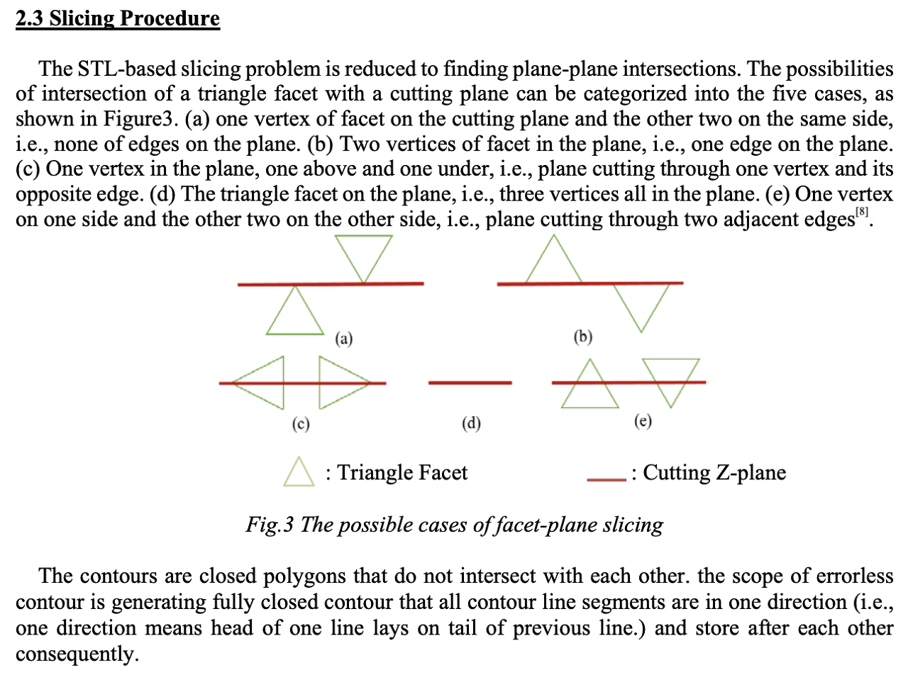
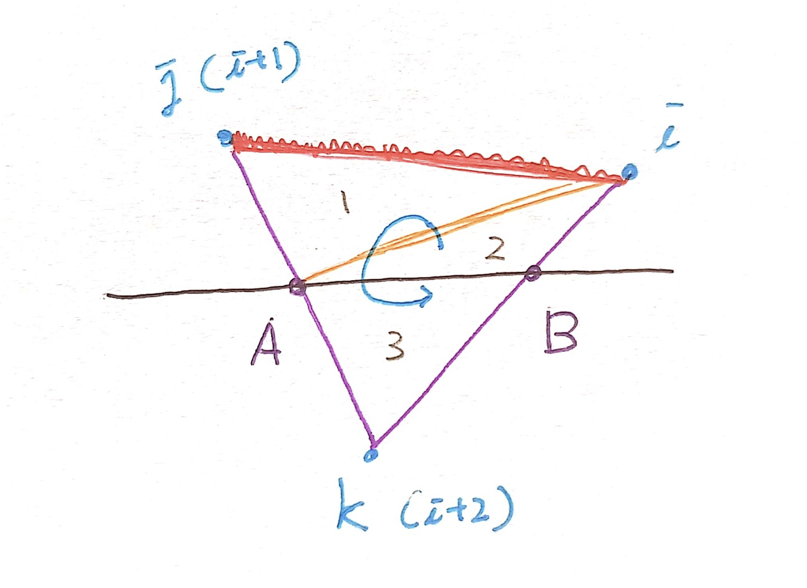
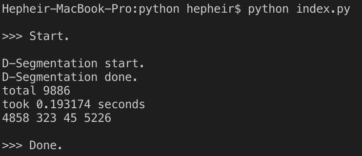
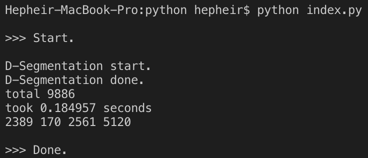
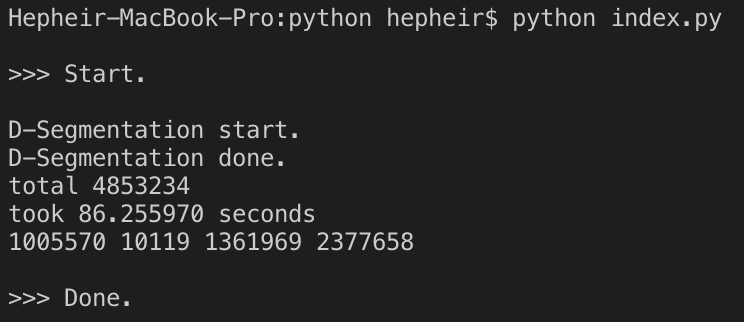

#### cutting

앞서 breakage 과정에서 얻은 : 단면에 걸친 Facet들을, 단면을 따라 반듯하게 자르는 처리과정을 cutting 이라고 하였다.

이 과정에서는 특수한 패턴으로 단면에 걸친 Facet에 대하여, 하나의 Facet을 3개의 작은 facets로 쪼갠다. (단면에 교차하는 모서리를 가지는 2개의 작은 facet과, 나머지 하나.) 

다음은 STL 파일로 된 3D 오브젝트를 3D 프린터를 이용하여 출력할 때, 각 레이어 별 도면을 어떻게 생성하는지에 관한 논문이다. 다름이 아니라 참고할 사진자료가 있어 들고왔다.



Fig.3 자료를 보면, 어떠한 단면에 대하여 삼각형을 반드시 쪼개야하는 패턴은 (c)와 (e)패턴이다.

우선, 위 패턴들 중 가장 까다로운 (e) 패턴을 어떻게 자를 것인지에 대해 생각을 정리해보았다.



각 facet에는 세 개의 꼭짓점이 있고, 이들의 순서는 각 facet의 normal의 방향에 맞추어 정렬되어있다. (오른손 법칙)

그럼 각 꼭짓점에 대하여, 다음을 행한다.

1.  단면인 z=0을 기준으로, z축 부호가 같은 두 꼭짓점을 찾는다. 이 때의 꼭짓점을 i, j번 꼭짓점이라 한다. (=그림의 빨간 모서리)
2.  이 때, 꼭짓점 j와 k가 이루는 선분, 꼭짓점 k와 i가 이루는 선분은 반드시 단면을 지난다고 할 수 있다. 이 교점을 각각 A, B라 하고, 두 점의 좌표를 구한다.
3.  위에서 구한 정보들을 이용해 삼각형 ijk를 3개의 작은 삼각형(삼각형 ijA 와  iAB / 삼각형 BAk)으로 분할한다.

이 과정이 끝난 후, 새로 만들어진 3개의 작은 facet을 front와 rear에 분배한다. (이 때, 한 facet의 꼭짓점들의 부호가 서로 다른 경우가 존재하지 않으므로, 모든 꼭짓점의 z값을 더하여 그 부호를 보고 front/rear로 분류한다.)

단면 데이터 또한 취해야 하므로, 위 과정에서 얻은 A,B점 좌표를 이용해, 선분 AB에 대한 정보를 section에 추가한다.

#### 검증용 코드

```
from stl import mesh
import stl
import numpy as np

import time

def DepthSegmentation(obj):
    """깊이 기반 분리 : <input> -> breakage -> cutting -> <output>"""
    assert isinstance(obj,mesh.Mesh)

    print('D-Segmentation start.')
    start = time.time()

    breakage = _breakage(obj)
    cutting  = _cutting(breakage)

    end = time.time()
    print('D-Segmentation done.')
    print('total %d'%obj.__len__())
    print('took %f seconds'%(end-start))
    return np.array(cutting)

def _breakage(obj):
    """메쉬를 전면, 배면, 단면으로 분류. 각 영역은 중복되지 않음."""
    z = obj.z
    n = obj.normals
    ret = [ [], [], [] ]
    for i in range(obj.__len__()):
        # Front or behind the xy-surface
        isFront = isRear = False
        for _z in z[i]:
            isFront |= (_z >= 0)
            isRear  |= (_z <= 0)
        #  - Find slices
        if isFront and isRear:
            ret[1].append(obj.data[i])
        #  - Find fronts and behinds
        elif n[i,2] > 0:
            if isFront:
                ret[0].append(obj.data[i])
            if isRear:
                ret[2].append(obj.data[i])
    return ret

def _cutting(breakage):
    """breakage 과정에서 section으로 분류된 facet의 후처리.
    - 단면에 걸치는 Facet을 모두 단면을 따라 정밀하게 3분할 및 front/rear로의 재분배.
    - 처리 이후 section에는 facet data가 아닌 2D 선분정보만 남게 됨.
    (front와 rear의 데이터형식은 변화없음.)"""

    def where_z_is_0(v0,v1):
        """두 벡터가 이루는 선분 상에서 z=0인 점을 계산."""
        x0,y0,z0 = v0
        x1,y1,z1 = v1
        x = (x0*z1 - x1*z0) / (z1 - z0)
        y = (y0*z1 - y1*z0) / (z1 - z0)
        return [x,y,0]

    front, section_breakage, rear = breakage
    section_cutting = []

    new_data = new_vectors = None
    i = j = k = A = B = C = z = None
    for normal,vectors,attr in section_breakage:
        z = vectors[:, 2]

        if np.prod(z) == 0:
            # Pattern (a), (b) or (c)
            # TODO
            print('found 0')
            continue

        else:
            # Pattern (e)
            for i in [0,1,2]:
                if (z[i] * z[(i+1)%3] > 0): break
            j = (i+1)%3
            k = (i+2)%3

            B = where_z_is_0(vectors[j],vectors[k])
            C = where_z_is_0(vectors[k],vectors[i])

            if B[:2] == C[:2]:
                # Meaningless to append a dot.
                continue

            section_cutting.append((B[:2],C[:2]))

            new_vectors = np.array([ # Create new reference : no need to .copy()
                [ vectors[i], vectors[j], B         ],
                [ vectors[i], B         , C         ],
                [ C         , B         , vectors[k]]]) # opp.

        if normal[2] > 0: # if Visible
            n_of_vectors = len(new_vectors)
            new_data = np.zeros(n_of_vectors, dtype=mesh.Mesh.dtype)
            new_data['vectors'] = new_vectors
            new_data['normals'] = [ normal ] * n_of_vectors
            new_data['attr']    = [ attr ]   * n_of_vectors

            for i in range(n_of_vectors):
                if np.sum(new_vectors[:,2]) > 0:
                    front.append(new_data[i])
                else:
                    rear.append(new_data[i])

    return front, section_cutting, rear
```

#### 결과

Section 처리 결과를 SVG로 출력함. (Front와 Rear의 처리결과는 아직 확인해보지 않았음.)

```
[[[ 결과 출력 예시 ]]]
Hepheir-MacBook-Pro:python hepheir$ python index.py

>>> Start.

D-Segmentation start.
D-Segmentation done.
total <입력 데이터의 총 Facet 개수> 
took <처리 소요시간> seconds
<Front Facet 개수> <Section 선분 개수> <Rear Facet 개수> <Front + Section + Rear 총 개수>

>>> Done.
```

")


")


")
(아마도 토기2.stl 오브젝트가 회전정렬되지 않은 상태로 입력되어서 위와 같이 출력된 것으로 추정.)


#### DISCUSSION

이전에 만들었던 알고리즘을 개선하면서, 불필요한 반복문, 불필요한 처리 등을 간소화/최적화 시킨 결과, O(3n + @) 꼴로 알고리즘을 개선할 수 있었다. 이에 따라 처리속도가 비약적으로 단축되었다.

예로, 대략 485만개의 Facet을 가지는 토기2의 경우, breakage과정에서 Non-Visible인 Facet을 배제시킨 결과, 실제로 처리되는 Facet의 개수는 약 237만개였으며, 처리하는데 소요된 시간은 약 86초이다.

처리 후 생성된 단면 SVG 이미지를 확인해본 결과, 아주 작은 흠집이나 굴곡까지 2D 벡터그래픽으로 투영되어 있었다.

벡터그래픽 특성상 이미지의 크기로 인한 데이터의 손실이 없다는 점에서, 필요에 맞게 이미지 크기를 조절하여 사용이 가능하며, 원본 stl 오브젝트로 부터 추출된 데이터가 그대로 투영되어 있으므로, 정밀한 데이터가 요구되는 작업에도 사용될 수 있을 것으로 기대된다.

이번 연구에서는 Fig.3의 (e) 패턴에 대한 cutting 작업만 다루었기에, 앞으로 나머지 패턴들에 대한 처리방법을 고안할 생각이다.